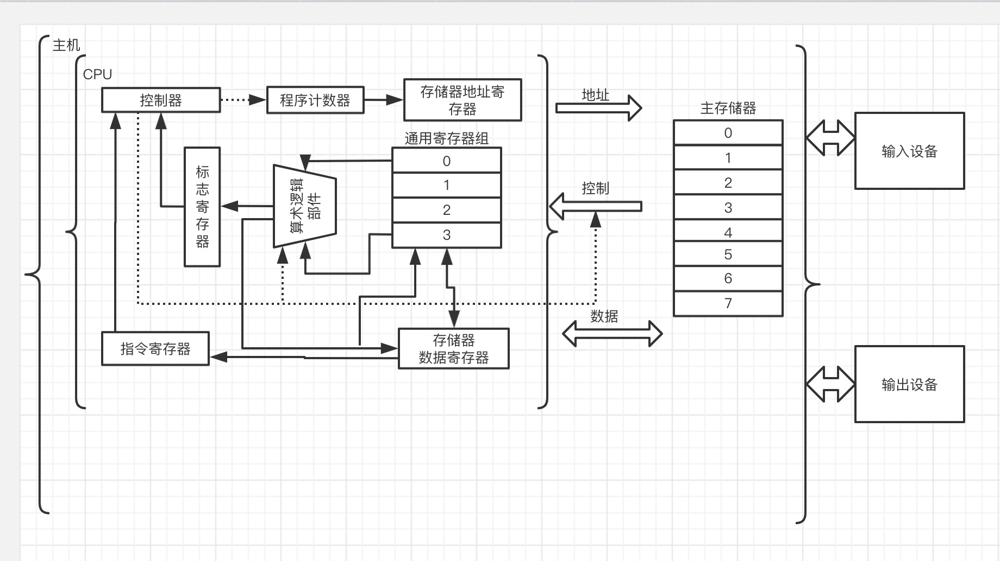

## 1.1 计算机硬件组成

#### 冯 · 诺依曼结构计算机的基本思想:

1. 采用”存储程序“的工作方式。
2. 计算机由**运算器**、**控制器**、**存储器**、**输入设备**和**输出设备**五个基本组件组成。
3. 组件功能: 
  - 存储器存储**数据**和**指令**; 数据和指令从形式上来说没有什么区别;
  - 控制器能自动执行指令;
  - 运算器能进行加减乘除等基本运算, 并且也可以进行逻辑运算
4. 计算机内部以二进制形式表示指令和数据, 每条指令由**操作码**和**地址码**组成

#### 程序执行过程:

1. 将程序 (命令和数据组成) 存入存储器
2. 将程序的命令逐条送入控制器进行译码, 生成对应的控制信号；
3. 控制将数据取到运算器，控制运算器进行运算，将结果存入存储器
4. 通过输出设备输出存储器中的结果

#### 现代计算机的基本组成:

现代计算机的基本组成主要包括: **中央处理器**、**存储器**、**外部设备**和**各类总线**

##### 中央处理器 (CPU):

CPU是整个计算机的核心部件, 主要指令的执行。它主要包含两个基本组件:

- 数据通路:
  - 指令执行过程中数据所流经的部件, 包括各类运算部件
  - 最重要的运算部件: 算术逻辑部件 (简称 ALU), 用来进行最基本的算术和逻辑运算
    - ALU中最基本的部件为加法器
    - 所有运算都可以基于加法运算和逻辑运算来实现
- 控制器:
  - 对指令进行译码, 生成对应的控制信号, 用于控制数据通路进行特定的操作

##### 存储器：

存储器分为内存和外存

- 内存:
  - 主存储器 (main memory 简称: 主存)
  - 高速缓冲存储器 (cache)
  - ps: 早期计算器中没有 cacha 所有一般不区分内存和主存, 两者含义都是主存储器
- 外存:
  - 辅助存储器 (简称: 辅存): 系统运行时直接和主存交换信息的存储器
    - 例: 磁盘存储器和固态硬盘
  - 海量后备存储器: 用于信息的备份和脱机存档
    - 例: 磁带存储器和光盘存储器

##### 外部设备：

简称外设, 也称为 **I/O 设备** 

- **设备控制器**:

##### 总线：

总线是传输信息的通路, 用于在部件之间传输信息。


## 1.2 计算机软件概述

#### 软件发展的三个阶段:

1. 从第一台计算机的第一个机器代码程序出现到实用的高级语言出现 (1946 - 1956)
  - 机器以CPU为中心
  - 采用机器语言编程
2. 从实用的高级语言出现到软件工程概念提出 (1956 - 1968)
  - 以存储器为中心
  - 出现操作系统
  - 出现高级语言
  - 出现数据库及其管理系统
  - ”软件工程“ 概念和方法的提出
3. 软件工程出现至今 (1968 - ~)
  - 着重研究具有智能化、自动化、集成化、并行化以及自然化特征的软件技术

#### 软件的用途

根据软件的用途, 将软件分为两大类: 系统软件/应用软件

##### 系统软件:

包括为有效、安全地使用和管理计算机以及为开发和运行应用软件而提供的各种软件, 介于计算机硬件与应用程序之间

1. 操作系统 (Operating System 简称 OS)
  - Windows、UNIX、Linux
  - 主要用来管理整个计算机系统的资源; 包括对资源的调度、管理、监视、服务;
  - 提供计算器用户与硬件之间的人机交互界面
  - 提供对应用软件的支持
2. 语言处理系统

  - Visual Studio、GCC
  - 提供用高级语言编程的环境，包括源码编辑、翻译、调试、链接、装入运行
3. 数据库管理系统
  - Oracle
4. 各类实用程序 (如磁盘碎片整理程序、备份程序)

##### 应用软件:

- 指专门数据处理、科学计算、事务管理、多媒体处理、工程设计、过程控制等应用所编写的各类程序


## 1.3 计算机系统的层次结构

#### 计算机系统抽象层的转换:

|      |                      |            |
| :--: | :------------------: | :--------: |
| 软件 |     应用 (问题)      |  最终用户  |
| 软件 |         算法         |   程序员   |
| 软件 |     编程 (语言)      |   程序员   |
| 软件 |   操作系统/虚拟机    |   程序员   |
|      | 指令集体系结构 (ISA) |   架构师   |
| 硬件 |      微体系结构      |   架构师   |
| 硬件 |     功能部件/RTL     |   架构师   |
| 硬件 |         电路         | 电子工程师 |
| 硬件 |         器件         | 电子工程师 |

#### 转换过程:

一个由自然语言描述的 **应用(问题)** 转化成机器语言程序, 所经过的多个抽象层的转换。

- 将应用(问题)转化为**算法**:

  让应用问题的求解变成流程化的清晰步骤, 并确保布置是有限的。任何一个问题可能有多个求解算法, 需要进行算法分析以确定哪种算法在时间和空间上能够得到优化。

- 将算法转换为用**编程语言**描述的程序:

  编程语言有严格的执行顺序, 不存在二义性, 能够唯一地确定计算机执行指令的顺序。

  - 编程语言从抽象层次上可分为 **高级语言** 和 **低级语言** 两类
  - 低级语言通常称为**机器级语言**, **机器语言**与**汇编语言**都是机器级语言
  - 机器语言: 由二进制进行编码的指令, 每条指令都是是 0/1 序列
  - 汇编语言: 因为机器语言的可读性差, 引入了机器语言的符号表示语言, 通过简短英文符号和二进制建立对应关系, 该语言被称为汇编语言

- 将高级语言程序转换为计算机能理解的机器语言程序

  - 该转换过程由计算机自动完成。
  - 进行对程序进行编辑、转换并链接的软件统称为: **语言处理系统** 
  - 任何语言处理系统中都包含一个**翻译程序**: 将编程语言表示的程序转换为等价的另一种编程语言程序。
  - 被翻译的语言和程序称为: 源语言，源程序; 翻译生成的语言和程序称为: 目标语言, 目标程序
  - 翻译程序有以下三类:
    - 汇编程序 (也称 **汇编器**): 用来将汇编语言源程序翻译成机器语言目标程序。
    - 解释程序 (也称 **解释器**): 用来将源程序中的语句按其执行顺序逐条用子程序进行解释, 并最终转换成机器指令执行。
    - 编译程序 (也称 **编译器**): 用来将高级语言源程序翻译成汇编语言或机器语言目标程序。
  - 所有语言处理系统都必须再**操作系统**提供的计算机环境中运行, 操作系统是对计算机底层结构和计算机硬件的一种抽象, 这种抽象构成了**虚拟机**

- 机器语言程序运行的计算机硬件和软件之间的桥梁

  软件与硬件之间的界面为: **指令集体系结构(ISA)** 简称 **体系结构**或**系统结构**, 它是软件和硬件之间接口的完整定义。(p30)

  - 机器语言程序就是一个 ISA 规定的指令的序列, 因此计算机硬件执行机器语言程序的过程就是让其执行一条一条指令的过程

- 微体系结构:

  微体系结构是 ISA 中对指令系统的规范或结构规范 具体实现组织。 微体系结构简称 **微架构** 

  - ISA 与 微体系结构是两个不同层面上的概念, 
  - 微体系结构是软件不可感知的部分
  - 相同的 ISA 可能具有不同的微体系结构
  - 微体系结构最终是由逻辑电路实现的, 微架构中的一个功能部可以用不同的逻辑来实现, 用不同的逻辑实现方式得到的性能和成本有差异

- 器件技术

  - 每个基本的逻辑电路都是按照特定的**器件技术**实现的

#### 不同用户所在的工作层次:

按照在计算机上完成任务的不同, 将计算机的用户分成以下4类: 最终用户、系统管理员、应用程序员和系统程序员

##### 最终用户

- 使用应用程序完成特定任务的计算机用户成为**最终用户**
- 最终用户能够感知到的只是系统提供的简单人机交互的界面和安装在计算机中的相关应用程序

##### 系统管理员

- 系统管理员是指利用操作系统等软件提供的功能对系统进行配置、管理合维护, 以建立高效合理的系统环境供计算机用户使用的操作人员
- 系统管理员能感知到的是系统中部分硬件层面、系统层面以及相关的实用程序和人机交互界面

##### 应用程序员

- 应用程序员是指使用高级语言编制应用软件的程序员, 应用程序员大多使用高级语言编写程序。
- 应用程序员看到的计算机除了计算机硬件、操作系统提供的应用编程接口(API)、人机交互界面和实用程序外, 还包括相应的程序语言处理系统。
- 语言处理系统中, 除了翻译程序外, 通常还包括编辑程序、链接程序以及将这些程序和工具集成在一起所构成的集成开发环境(IDE)

##### 系统程序员

- 系统程序员指设计和开发系统软件的程序员
- 系统程序员所看到机器属性为 ISA 层面的内容

#### 层次化结构:  (P32)

ISA 处于硬件和软件的交界面上, 硬件所有功能被抽象成一个**指令集体系结构**, 所以硬件功能由ISA集中体现。软件中的程序代码由ISA规定的指令组成, 通过CPU执行一条一条指令来完成程序的执行, 所以, ISA 是整个计算机系统中的核心部分

ISA 层下面是硬件部分, 上面是软件部分:

- 硬件包括: CPU、主存和输入/输出设备等主要功能部件, 这些功能部件通过数字逻辑电路设计实现。
- 软件层包括: 低层的系统软件和高层的应用软件; 
  - 汇编程序, 编译程序和操作系统等这些系统软件直接在 ISA 上实现
- 系统程序员看到的机器的属性是属于ISA层面的内容:
  - 看到的机器是配置了指令系统的机器, 称为机器语言机器, 在该层次的程序员为机器语言程序员;
- 系统管理员工作在操作系统层, 所看到的是配置了操作系统的虚拟机器, 称为操作系统虚拟机
- 汇编语言程序员工作在提供汇编程序的虚拟机器级, 所看到的机器, 称为汇编语言虚拟机;
- 应用程序大多工作在提供编译器或解释器等翻译程序的语言处理系统层, 因此应用程序员大多用高级语言编写程序, 也称为高级语言程序员, 所看到的虚拟机器称为高级语言虚拟机
- 最终用户则工作在最上面的应用程序层。

#### 透明:

在计算机技术中, 一个存在的事物或概念从某个角度看似不存在, 也即, 对实际存在的事物或概念感觉不到, 则称为**透明**


## 1.4 程序开发与执行过程:

编写程序并让其在计算机上执行，是为了解决最终用户应用问题. 所以程序有时被称为**用户程序**或**应用程序**

### 从源程序到可执行目标程序:

以C语言的 `hellow world` 为例分为四个阶段:

```C
#include <stdio.h>
int main(){
  printf("hellow world\n")
}
```


- 预处理阶段: 预处理程序(cpp) 对以`#`开头的命令进行处理, 镶嵌`#include`命令后面的文件内容到源程序文件中。
- 编译阶段: 编译程序(ccl) 对预处理的后的源程序文件进行编译, 生成汇编语言源程序文件
- 汇编阶段: 汇编程序(as) 对汇编语言源程序进行汇编, 生成一个**可重定位目标文件**, 该文件是二进制文件, 其中的代码已经是机器指令, 且该文件是不可读的。
- 链接阶段: 链接程序(ld) 将多个可重定位目标文件和标准库函数目标模块合并成一个可执行文件。

### 冯 · 诺依曼结构模型机



**算术逻辑部件(ALU)**: 进行算术运算和逻辑运算;

**通用寄存器组(GPRs)**: 由若干通用寄存器组成, 存放操作数或操作数的地址;

**标志寄存器**: 存放ALU运算得到的标志信息, 如结果是否为0、有没有生产进位或借位、结果是否为负数等

**程序计数器(PC)**: 存放将要执行的下一条指令的地址;

**指令寄存器(IR)**: 存放从主存储器读出的指令, 指令中的操作码被送到控制器进行译码, 生产控制信号, 可控制如何修改PC以得到下一条指令的地址

**主存储器**: 用来存储指令和操作数, 每个存储单元都有一个编号, 该编号为主存地址。

**存储器地址寄存器(MAR)**: 用于存放将要送到主存储器的主存地址, MAR中的地址信息被直接送到地址线上；控制线中有读/写信号线, 指出数据是从CPU写入主存储器还是从住存储器读到CPU。

**存储器数据存储器(MDR)**: 用来存放CPU与主存储器交换的数据

**主机**: CPU和主存构成主机

### 程序与指令的关系:

可执行目标文件中包含机器代码段, 可执行文件的执行实际上是所有包含的机器代码段执行的过程。

**指令**: 用0/1表示的一串0/1序列, 用来指示CPU完成一个特定的基本操作。

- **取数指令**: 从存储单元取出一个数据存放到CPU内的通用寄存器中;
- **存数指令**: 将CPU中的通用寄存器的内容写入一个存储单元;
- **ALU 指令**: 将两个通用寄存器内容进行某种算术或逻辑运算后再送入一个通用寄存器中

指令通常被划分为若干个字段：操作码字段、地址码字段:

- **操作码字段**: 指出指令的操作类型, 如加减乘除等;
- **地址码字段**: 指出指令处理的操作数所在的存储地址. 如通用寄存器编号, 内存单元地址

### 指令的执行过程:

冯诺依曼结构采用“存储程序”的工作方式, 因此组成一个程序的指令序列以及程序所处理的操作数都被事先存放在了主存储器中。程序中的第一条指令的地址置于PC中。

- 第一步: 根据PC中的第一条指令的地址码取指令到IR
- 第二步: 指令译码并送出控制信号；
- 第三步：取操作数
- 第四步：执行指令
- 第五步：回写结果

## 1.5 计算机系统性能评价

### 用CPU执行时间进行评估:

CPU 执行时间 = 程序所含时钟周期数 / 时钟频率

CPU执行时间 = 程序所含时钟周期数 X 时钟周期

程序总时钟周期数 = 程序所含指令条数 X CPI

程序总时钟周期数 = ∑ (CPI X C)

### 用执行速度进行评估

### 用基准程序进行评估